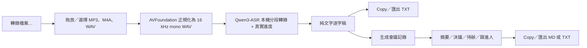

# PRD — CantoFlow Transcribe v1

| 項目 | 內容 |
|---|---|
| 功能名稱 | 檔案轉錄與會議記錄 |
| 狀態 | Ready for implementation |
| 產品負責人 | Johnson Tam |
| 目標平台 | macOS 13+，Apple Silicon（M1 或以上） |
| 最後更新 | 2026-06-21 |
| 實作對象 | Claude Code |

**相關文件：** [`feature-list.md`](feature-list.md)、[`refs/README.md`](refs/README.md)

---

## 1. 摘要

CantoFlow 現時已經有本機 Qwen3-ASR、詞庫注入及多供應商 LLM。Transcribe v1 要把這些能力由「即時 push-to-talk」延伸至「音頻檔案」：用戶可拖放或選擇一批會議錄音，在本機順序轉成純文字逐字稿，再按一次按鈕，把整份逐字稿交給目前選定的 LLM 生成繁體中文會議記錄，最後複製或匯出為 `.txt` / `.md`。

v1 明確以「可靠完成一場 30–60 分鐘會議」為目標，不追求逐字時間軸、講者分離或播放器同步。



---

## 2. 背景與問題

經常開會的用戶通常有一個音頻檔，但欠缺一條低摩擦流程把它變成可交付的會議記錄。現有方案常見問題包括：

- 要上傳音頻到第三方服務，涉及私隱和等待；
- 為時間戳、播放器、講者分離堆疊大量功能，但用戶真正需要的是一份可複製的逐字稿和清晰的行動項目；
- 長音頻處理期間沒有可信進度，容易令人以為程式死機；
- 逐字稿與會議摘要分散在不同工具，要手動搬運。

CantoFlow 已具備本機 ASR 和 LLM provider plumbing，適合用一個小而完整的 v1 解決上述流程。

---

## 3. 產品目標

### 3.1 必須達成

1. 用戶可從 menu bar 開啟獨立的「檔案轉錄」視窗。
2. 支援拖放、檔案選擇及批次 queue。
3. 使用已安裝的 **Qwen3-ASR 0.6B MLX 8-bit** 在本機轉錄。
4. 30–60 分鐘錄音處理期間有真實、單調遞增的進度。
5. 每個檔案獨立產生純文字逐字稿，能 Copy 和匯出 `.txt`。
6. 每個已完成逐字稿可一 click 生成會議記錄。
7. 會議記錄至少包含摘要、決議、待辦事項及跟進人，能 Copy 和匯出 `.md` / `.txt`。
8. 單一檔案失敗不拖垮整個 batch；用戶可重試或繼續處理其他檔案。
9. 不破壞現有 push-to-talk、capsule、個人詞庫和 LLM polish 流程。

### 3.2 成功指標

- 首次使用者不看說明，也能由 menu bar 在 3 次點擊內開始處理一個檔案。
- 60 分鐘音頻在 M1 8 GB 和 M4 測試機上完成，不發生 OOM、UI freeze 或無限等待。
- 進度至少在每個 Qwen internal chunk 完成時更新一次。
- 轉錄完成後，逐字稿不需要經 clipboard 或其他 app 才能生成會議記錄。
- ASR 失敗、LLM 失敗和取消三種情況都不會令已完成的逐字稿消失。

---

## 4. 非目標／延後項目

以下全部 **不屬於 v1**，Claude Code 不應順手加入：

- Segments view、時間戳、SRT、VTT；
- transcript reflow、merge segment、按字數／字詞重分段；
- 音頻播放器、scrubber、逐字稿同步 highlight；
- 講者分離、speaker labels、聲紋識別；
- 影片格式（MP4、MOV、M4V）及抽取影片音軌；
- FLAC、OGG、OPUS 等額外格式；
- per-segment AI、自由輸入「Ask AI」；
- 即時 streaming transcript；
- 多個音頻合併為同一場會議；
- 自動生成會議記錄；必須由用戶明確點擊；
- 雲端 ASR、帳戶、同步、團隊協作、搜尋歷史；
- Windows 版本。

---

## 5. 目標用戶與主要情境

### Persona

每星期經常參與內部會議、客戶會議或課堂討論，手上已有錄音，希望快速取得繁體中文記錄的人。用戶可能不懂 ASR 模型、token 或 ffmpeg，不應要求他們設定技術參數。

### 核心 user stories

- 作為會議參與者，我想拖入一個 45 分鐘 M4A，離開一會再回來取得逐字稿。
- 作為行政同事，我想一次排入數個錄音，讓 CantoFlow 順序處理，不用逐個重新操作。
- 作為會議主持，我想把逐字稿一 click 變成有決議和 action items 的 Markdown。
- 作為私隱敏感用戶，我想知道音頻是否離開本機，以及生成會議記錄時哪些文字會傳給哪個 LLM。
- 作為現有 CantoFlow 用戶，我不想檔案轉錄期間誤觸熱鍵而同時載入第二份 Qwen 模型。

---

## 6. v1 產品範圍

| 範圍 | v1 決定 |
|---|---|
| 入口 | Menu 新增「轉錄檔案…」 |
| 輸入 | WAV、MP3、M4A；拖放、檔案選擇、批次 |
| ASR | 固定 Qwen3-ASR 0.6B MLX 8-bit，不跟隨 push-to-talk 的 active engine |
| 語言 | 自動偵測；保留廣東話；輸出經現有 OpenCC `s2hk` 轉香港繁體 |
| 詞庫 | 沿用 `VocabularyStore`，同一份 context 套用至所有 internal chunks |
| 輸出 | 每檔案一份 plain text；沒有公開 segment／timestamp model |
| AI | 整份逐字稿一次送入目前選定的 LLM，產生固定會議記錄模板 |
| 匯出 | Transcript：TXT；Meeting notes：MD 或 TXT |
| Batch | 最多 20 個檔案，順序處理；每檔案獨立結果 |
| v1 guardrail | 每檔案最長 120 分鐘、最大 2 GB；超出時在加入 queue 前拒絕並解釋 |

> 120 分鐘及 2 GB 是 v1 防止 8 GB Mac 出現記憶體／磁碟壓力的產品 guardrail，應寫成集中常量，日後可按實測調整。

---

## 7. 使用流程

### 7.1 開啟與加入檔案

1. 用戶點 menu bar → **「轉錄檔案…」**。
2. CantoFlow 打開一個可重用、非 modal 的視窗。
3. 空白狀態顯示拖放區及「選擇音頻檔案」按鈕。
4. 用戶拖入或選擇一個／多個檔案。
5. App 立即驗證格式、是否可讀、檔案大小和 duration。
6. 合格檔案加入 queue；重複 URL 不重複加入。

### 7.2 批次轉錄

1. 用戶按 **「開始轉錄」**。
2. App preflight：
   - Qwen runtime 和 model 是否 ready；
   - 現時有沒有 push-to-talk 或另一個 file batch 佔用 ASR；
   - cache/output 目錄是否可寫；
   - 是否有足夠臨時磁碟空間。
3. App 用 AVFoundation 順序把所有 input 轉成 16 kHz、mono、16-bit PCM WAV。
4. Python worker 只啟動一次、模型只載入一次，順序處理所有 WAV。
5. UI 顯示目前檔案、batch overall progress、per-file progress 和 chunk x/y。
6. 每個檔案完成後立即落地 transcript，queue 自動處理下一個。
7. 個別檔案失敗時標記失敗，batch 繼續。

### 7.3 查看逐字稿

1. 用戶在左側 queue 選取已完成檔案。
2. 右側顯示 **「逐字稿」** view；文字可選取但 v1 不提供編輯。
3. Toolbar 提供：
   - Copy；
   - 匯出 TXT；
   - 生成會議記錄。
4. 檔案轉錄完成後不得自動 paste 到當前 app；只在用戶點 Copy 時寫 clipboard。

### 7.4 生成會議記錄

1. 用戶按 **「生成會議記錄」**。
2. 若未設定可用 LLM，按鈕不可執行並顯示「前往 LLM 設定」。
3. 若目前 provider 是 cloud，首次使用顯示一次私隱確認：
   - 音頻不會上傳；
   - 整份逐字稿會傳送至 `{provider display name}`；
   - 提供「取消」和「同意並生成」。
4. App 以整份 transcript 發出一次 LLM request。
5. 成功後顯示 **「會議記錄」** view，提供 Copy、匯出 MD、匯出 TXT、重新生成。
6. LLM 失敗只影響 notes，不影響 transcript。

---

## 8. UX 規格

### 8.1 Menu

- 在主要「開始錄音」項目之後加入：**「轉錄檔案…」**。
- 建議 SF Symbol：`waveform.badge.plus` 或 `doc.badge.plus`。
- 不設 keyboard equivalent，避免與錄音及學習 hotkey 衝突。
- Batch 進行時 menu item 顯示「檔案轉錄中…」但仍可點擊回到視窗。

### 8.2 主視窗

建議初始尺寸：`960 × 680`，最小尺寸：`760 × 520`。

```text
┌──────────────────────────────────────────────────────────────────────┐
│ 檔案轉錄                                      ＋ 加入檔案   開始轉錄 │
├──────────────────────┬───────────────────────────────────────────────┤
│ Queue                │ [逐字稿] [會議記錄]                          │
│                      │                                               │
│ ● meeting-01.m4a     │  純文字內容……                                 │
│   43:18 · 已完成      │                                               │
│ ◐ meeting-02.mp3     │                                               │
│   Chunk 18/87 · 21%  │                                               │
│ ○ meeting-03.wav     │                                               │
│   等候中              │                                               │
│                      │                                               │
├──────────────────────┴───────────────────────────────────────────────┤
│ 整體進度  ███████░░░  38%       停止        Copy   匯出   生成會議記錄 │
└──────────────────────────────────────────────────────────────────────┘
```

### 8.3 狀態與中文文案

| Internal state | 顯示文案 | 行為 |
|---|---|---|
| `queued` | 等候中 | 可移除 |
| `validating` | 檢查檔案… | indeterminate |
| `preparing` | 準備音訊… | 顯示 conversion progress |
| `transcribing` | 正在轉錄 · Chunk x/y | 顯示真實 Qwen progress |
| `transcriptReady` | 逐字稿已完成 | 可 Copy／export／notes |
| `generatingNotes` | 正在生成會議記錄… | notes button spinner |
| `complete` | 會議記錄已完成 | 所有 output actions 可用 |
| `failed` | 失敗：{human-readable reason} | 顯示重試 |
| `cancelled` | 已停止 | 已完成 output 保留 |
| `completedWithWarning` | 已完成，但部分內容可能不完整 | 顯示 truncation warning |

### 8.4 Queue 行為

- 同一 source URL 在同一 queue 只可出現一次。
- Processing 中不可 reorder；仍可加入新檔，新檔排到尾部。
- Processing 中移除 queued file 可以；不可移除目前 processing file，除非先停止 batch。
- Batch 完成後可「清除已完成項目」，但不可刪除 source audio。
- 關閉視窗不取消工作；menu bar 顯示 processing 狀態。Quit app 時必須詢問是否停止。

### 8.5 Progress

- **禁止假進度 timer。** ASR progress 必須來自 Qwen `on_progress` payload。
- Per-file ASR progress：使用 dependency 回傳的 `progress`（0…1）。
- Overall ASR progress：按檔案 duration 加權：

```text
(已完成檔案總秒數 + 當前檔案秒數 × 當前 progress) ÷ 全 batch 總秒數
```

- Preparation 與 ASR 分兩個 stage 顯示；不要把 conversion 假裝成 ASR chunk。
- v1 不要求 ETA；如果實作 ETA，必須在至少完成 3 個 chunks 後才顯示，並標明「估計」。

---

## 9. 功能需求

### 9.1 File intake

| ID | Requirement |
|---|---|
| FR-001 | 支援以 drag-and-drop 和 `NSOpenPanel` 加入 `.wav`、`.mp3`、`.m4a`。 |
| FR-002 | `NSOpenPanel` 必須允許 multiple selection，只顯示支援格式。 |
| FR-003 | 每個 queue row 顯示檔名、duration、size、status；不得為畫 waveform 而預先 decode 全檔。 |
| FR-004 | 拒絕 folder、URL、DRM／不可解碼檔、零長度檔、>2 GB 或 >120 分鐘檔案。 |
| FR-005 | 加入失敗要逐檔解釋，不可因其中一個壞檔而拒絕其他合格檔。 |
| FR-006 | Source audio 必須 read-only；App 不可 rename、move 或 modify。 |

### 9.2 Audio preparation

| ID | Requirement |
|---|---|
| FR-010 | 所有輸入均先用 AVFoundation 正規化成 16 kHz、mono、16-bit PCM WAV。 |
| FR-011 | 不可假設用戶安裝 Homebrew 或 ffmpeg；v1 不新增外部 binary 依賴。 |
| FR-012 | Conversion 必須串流讀寫，不可一次把完整 decoded audio 放入 Swift memory。 |
| FR-013 | 每個 temp WAV 使用 UUID filename，放在 batch workspace 的 `temp/`。 |
| FR-014 | File 完成、失敗或取消後清理對應 temp WAV；App 下次啟動清理 24 小時前遺留 temp。 |
| FR-015 | Preflight 以 `總音頻秒數 × 32,000 bytes × 1.2` 估算 canonical WAV 暫存需要量，預留 20% headroom。 |

### 9.3 Local ASR

| ID | Requirement |
|---|---|
| FR-020 | File transcription 固定使用 Qwen3-ASR，不使用 Whisper／SenseVoice selector。 |
| FR-021 | 若 Qwen 未安裝，禁止開始並提供「前往 Settings → Models」CTA。 |
| FR-022 | Batch 只啟動一個 Python worker，worker 只載入 Qwen model 一次。 |
| FR-023 | Worker 按 queue 順序逐檔呼叫 `mlx_qwen3_asr.transcribe()`。 |
| FR-024 | 沿用現有 vocabulary context，最大長度和 push-to-talk 一致。 |
| FR-025 | 使用 dependency 內建 energy-based chunking；不可在 Swift 再切一次。 |
| FR-026 | 使用 `return_timestamps=False`、`diarize=False`、`return_chunks=False`；產品資料模型不可暴露 segments。 |
| FR-027 | 用 `on_progress` 將 chunk progress 以 JSONL 傳回 Swift。 |
| FR-028 | 每檔案完成後用 OpenCC `s2hk`，並以 UTF-8 原子寫入 `.txt`。 |
| FR-029 | `result.truncated == true` 時保留文字但標記 `completedWithWarning`。 |
| FR-030 | 一個檔案 exception 只產生 `file_failed`，worker 繼續下一個。 |

### 9.4 Batch control

| ID | Requirement |
|---|---|
| FR-040 | 同一時間最多一個 batch、batch 內最多一個 file 正在 ASR。 |
| FR-041 | Batch ASR 與 push-to-talk 必須互斥，防止兩個 Qwen process 同時佔用 GPU／RAM。 |
| FR-042 | File batch 活躍時按 push-to-talk，顯示「檔案轉錄進行中，請先停止」而非開始錄音。 |
| FR-043 | Push-to-talk 正在錄音／處理時，開始 batch button disabled。 |
| FR-044 | 「停止」必須 terminate worker process；最多 2 秒內 UI 轉為 cancelled。 |
| FR-045 | 停止後保留已完成 transcript；目前未完成檔不產生假完成結果。 |
| FR-046 | Batch 工作期間使用 `ProcessInfo.beginActivity` 防止 App Nap／idle sleep；完成或取消後釋放。 |

### 9.5 Transcript output

| ID | Requirement |
|---|---|
| FR-050 | 每個完成檔案顯示一份 read-only plain-text transcript。 |
| FR-051 | Copy 只複製 transcript 本文，不加 filename、狀態或 UI 文案。 |
| FR-052 | Export TXT 以 UTF-8、Unix newline 寫出；預設 filename `{source-basename}-transcript.txt`。 |
| FR-053 | 若目標已存在，使用 `NSSavePanel` 的標準 overwrite confirmation；不可靜默覆寫。 |
| FR-054 | Transcript 完成後立即 autosave 到 internal workspace，避免 LLM 失敗或視窗關閉造成遺失。 |

### 9.6 Meeting notes

| ID | Requirement |
|---|---|
| FR-060 | Meeting notes 只可由已完成且非空 transcript 生成。 |
| FR-061 | 使用 Settings 中目前選定的 LLM provider 和 key；不得另造一套 API key UI。 |
| FR-062 | 整份 transcript 一次處理；v1 不做 per-chunk AI 或 map-reduce。 |
| FR-063 | 為 meeting notes 建立獨立 prompt，不得重用 short polish prompt／1024 output-token limit。 |
| FR-064 | Meeting notes request 建議 `temperature=0.1`、`maxOutputTokens/max_tokens=4096`。 |
| FR-065 | 供應商沒有足夠 context 或 request 失敗時，顯示 provider error；transcript 保持可用。 |
| FR-066 | Cloud provider 第一次使用必須披露 transcript 會離開本機；只上傳文字，不上傳音頻。 |
| FR-067 | Copy notes 保留 Markdown；Export MD 預設 `{source-basename}-meeting-notes.md`。 |
| FR-068 | Export TXT 需去除 Markdown table pipe／heading markers，輸出可讀 plain text。 |
| FR-069 | 重新生成前保留舊 notes，只有新 request 成功才原子取代。 |

---

## 10. 會議記錄輸出合約

### 10.1 System prompt

Claude Code 應把 prompt 放在獨立、可測試的 `MeetingNotesPrompt.swift`，不要散落 UI：

```text
你是一位嚴謹的香港繁體中文會議記錄員。請只根據逐字稿整理會議記錄，不可補充逐字稿沒有的事實，不可猜測講者身份、跟進人或期限。

要求：
1. 保留重要專有名詞、數字、日期和英文產品名。
2. 刪除重複語氣詞，但不得扭曲原意。
3. 只有逐字稿明確形成共識時才列為「決議」。
4. 只有逐字稿明確要求行動時才列為「待辦事項」。
5. 跟進人或截止日期沒有明確提及時，填「未指定」，不可自行分配。
6. 若某部分沒有資料，明確寫「未有明確記錄」，不可省略 section。
7. 只輸出以下 Markdown，不要加前言、解釋或 code fence。
```

### 10.2 Markdown schema

```markdown
# 會議記錄

## 會議摘要
<3–8 點或短段落>

## 主要討論
- <重點>

## 決議
- <決議；若沒有則寫「未有明確決議」>

## 待辦事項
| 待辦事項 | 跟進人 | 截止日期 |
|---|---|---|
| <行動> | <明確姓名或未指定> | <明確日期或未指定> |

## 未決問題
- <尚待確認事項；若沒有則寫「未有明確記錄」>
```

### 10.3 User prompt

```text
來源檔案：{filename}
錄音日期：{file creation date if available, otherwise 未知}

以下是完整逐字稿：

<transcript>
```

### 10.4 驗證規則

- 輸出必須含五個固定 headings。
- 不要求把 Markdown parse 成複雜 domain model；v1 可保存原始 Markdown。
- 若 headings 缺失，不要丟棄內容；顯示結果並記錄 `notes_format_warning`（不記 transcript 本文）。

---

## 11. 技術現況與設計決定

### 11.1 已確認的現況

1. 現有 [`LocalASRRunner.swift`](../../app/Sources/CantoFlowApp/Core/LocalASRRunner.swift) 每次 transcription 都啟動一個 Python process，適合短 push-to-talk，但 batch 逐檔這樣做會反覆載入模型。
2. 現有 [`local_asr_bridge.py`](../../scripts/local_asr_bridge.py) 只接受一個 input／一個 output，沒有 streaming progress protocol。
3. 已安裝及 pin 的 `mlx-qwen3-asr==0.3.5`：
   - `transcribe()` 會把長音頻按低能量位切成約 30 秒 chunks；
   - `on_progress` 提供 `chunks_prepared`、`chunk_started`、`chunk_completed`、`progress`；
   - model/tokenizer 在同一 Python process 內有 cache；
   - file loader 對非標準 16 kHz WAV／MP3／M4A 依賴 ffmpeg。
4. CantoFlow 的學生安裝流程不保證有 Homebrew 或 ffmpeg，因此必須在 Swift 用 AVFoundation 做 canonical WAV conversion。
5. 現有 `TextPolisher` 是短文字用途，prompt 和 output cap 不適合整場會議；需抽出共用 completion transport。

### 11.2 架構原則

- **不要改壞 push-to-talk path。** File transcription 使用獨立 service／worker；共用的只應是 paths、vocabulary、LLM transport 和 ASR exclusivity coordinator。
- **不要重造 Qwen chunker。** Dependency 已有 chunking 和進度；CantoFlow 只轉發和呈現。
- **一次 batch，一個 worker，一次 model load。** 不 parallel ASR。
- **stdout 只傳 JSONL event；正文寫檔。** 避免長 transcript 塞爆 pipe 或 log。
- **所有 AppKit／SwiftUI state mutation 在 MainActor。** Audio conversion、process I/O、file I/O 不可在 main thread。
- **窗口長存。** 參考 Settings crash 經驗，`TranscribeWindowController` 必須強持有 `NSWindow`、`NSHostingController` 和 store，`isReleasedWhenClosed=false`，不要每次打開重新建立 Combine graph。

---

## 12. 建議模組與檔案

Claude Code 可按現有命名微調，但責任邊界必須保留：

```text
app/Sources/CantoFlowApp/
├── Core/
│   ├── ASRWorkCoordinator.swift
│   ├── FileTranscription/
│   │   ├── FileTranscriptionModels.swift
│   │   ├── AudioPreparationService.swift
│   │   ├── FileTranscriptionRunner.swift
│   │   ├── TranscriptionWorkspace.swift
│   │   ├── MeetingNotesGenerator.swift
│   │   └── MeetingNotesPrompt.swift
│   └── LLM/
│       └── LLMCompletionClient.swift
├── UI/
│   └── Transcribe/
│       ├── TranscribeWindowController.swift
│       ├── TranscribeView.swift
│       ├── TranscriptionQueueView.swift
│       └── TranscriptDetailView.swift

scripts/
└── file_transcription_worker.py
```

### 12.1 Existing files to modify

| File | Change |
|---|---|
| `MenuBarController.swift` | 新 menu item、開窗、batch active 顯示、PTT guard |
| `STTPipeline.swift` | 在 PTT start/finish/cancel acquire/release ASR ownership；不可改 transcription output semantics |
| `TextPolisher.swift` | 抽出共用 provider resolution／HTTP completion；保留現有 polish regression behavior |
| `AppConfig.swift` | 只加集中 v1 constants／paths（如有需要） |
| `package_app.sh` | 把 `file_transcription_worker.py` bundle 到 `Resources/asr/` |
| `AppDelegate.swift` | 預熱／強持有 Transcribe window controller 或 activity coordinator（如架構需要） |

---

## 13. Data model

```swift
enum FileTranscriptionStatus: Equatable, Codable {
    case queued
    case validating
    case preparing(progress: Double)
    case transcribing(progress: Double, chunk: Int, totalChunks: Int)
    case transcriptReady
    case generatingNotes
    case complete
    case completedWithWarning(String)
    case failed(String)
    case cancelled
}

struct FileTranscriptionItem: Identifiable, Codable {
    let id: UUID
    let sourceURL: URL
    let displayName: String
    let fileSizeBytes: Int64
    let durationSeconds: Double
    var status: FileTranscriptionStatus
    var transcriptURL: URL?
    var meetingNotesURL: URL?
    var language: String?
    var createdAt: Date
}

struct FileTranscriptionBatch: Identifiable, Codable {
    let id: UUID
    var items: [FileTranscriptionItem]
    var startedAt: Date?
    var finishedAt: Date?
}
```

如果 Swift `Codable` associated enum 令 persistence 複雜，可拆成 `statusKind + progress + message`；不要為了漂亮 type 犧牲 manifest 穩定性。

---

## 14. Workspace 與檔案保存

Root：

```text
~/Library/Application Support/CantoFlow/Transcriptions/<batch-uuid>/
├── manifest.json
├── temp/
│   └── <file-uuid>.wav
├── transcripts/
│   └── <source-basename>-transcript.txt
└── notes/
    └── <source-basename>-meeting-notes.md
```

規則：

- 不複製原始 audio；manifest 只記 source path 和 metadata。
- Transcript／notes 每次成功後以 temp file + rename 原子寫入。
- Temp WAV 成功、失敗或取消後刪除。
- App 啟動時清理所有 24 小時前的 `temp/` 殘留；不可自動刪 transcript／notes。
- UI v1 不必做 history browser，但 menu 的「打開輸出資料夾」應能讓用戶找到保存內容。
- Log／telemetry 只記 file extension、duration、size、latency、provider、status，不可記 filename 全路徑、transcript 或 notes 本文。

---

## 15. Python worker contract

### 15.1 Invocation

```bash
python3 file_transcription_worker.py \
  --manifest /path/to/manifest.json \
  --model-dir /path/to/qwen3-asr-0.6b-8bit \
  --output-dir /path/to/batch/transcripts \
  --traditional
```

Manifest：

```json
{
  "version": 1,
  "context": "CantoFlow 專有詞 香港常用詞",
  "files": [
    {
      "id": "uuid",
      "input_wav": "/absolute/temp/file.wav",
      "output_txt": "/absolute/transcripts/file-transcript.txt"
    }
  ]
}
```

### 15.2 stdout JSONL events

每個 event 一行、UTF-8、立即 `flush=True`：

```json
{"v":1,"event":"worker_ready","total_files":3}
{"v":1,"event":"file_started","file_id":"uuid","file_index":1,"total_files":3}
{"v":1,"event":"asr_progress","file_id":"uuid","progress":0.21,"chunk_index":18,"total_chunks":87,"processed_audio_sec":540.0,"audio_duration_sec":2578.2}
{"v":1,"event":"file_completed","file_id":"uuid","output_txt":"/path/file.txt","chars":12345,"language":"Cantonese","truncated":false,"duration_ms":88210}
{"v":1,"event":"file_failed","file_id":"uuid","code":"decode_failed","message":"Unable to decode canonical WAV"}
{"v":1,"event":"batch_completed","succeeded":2,"failed":1,"duration_ms":190120}
```

Protocol rules：

- stdout 不可印 debug、warning 或 transcript；所有 diagnostics 寫 stderr。
- Swift 必須同時 drain stdout 和 stderr，避免 pipe deadlock。
- Unknown event/version 應記 diagnostic 並忽略，不可 crash UI。
- Worker-level manifest/model failure：non-zero exit。
- Individual file failure：emit `file_failed` 後繼續，worker 最後正常 exit。
- Swift cancellation 以 terminate process 實作；不用在 v1 設計 pause/resume protocol。

---

## 16. LLM 共用層

### 16.1 Refactor 要求

現有 `TextPolisher` 的 provider/key resolution 和 HTTP request 應抽成一個共用 completion client，例如：

```swift
struct LLMCompletionRequest {
    let systemPrompt: String
    let userPrompt: String
    let temperature: Double
    let maxOutputTokens: Int
}

protocol LLMCompleting {
    func complete(_ request: LLMCompletionRequest) async throws -> LLMCompletionResult
    func resolvedProvider() -> AppConfig.PolishProvider
    func isAvailable() -> Bool
}
```

- `TextPolisher` 繼續用原有短句 prompt、低 token cap。
- `MeetingNotesGenerator` 用本 PRD 的 notes prompt 和 4096 output cap。
- Provider-specific parameter 名稱差異由 client 處理：如 `max_tokens`、`max_completion_tokens`、Gemini `maxOutputTokens`。
- 不要在 `MeetingNotesGenerator` 複製六份 provider HTTP code。
- Refactor 後 push-to-talk 的 provider selection、fallback order、DeepSeek non-thinking 和 telemetry 必須保持不變。

### 16.2 Context guard

- v1 不做 transcript splitting／map-reduce。
- 送出前以粗略字元數 guard 捕捉明顯不合理輸入，但不要假裝精準 token count。
- Provider 回傳 context-too-long 時顯示：
  - 「逐字稿超出目前 LLM 可處理長度；請改用較大 context 的 provider。」
- Local LLM endpoint 的 context 長度未知，失敗時保留原始 error 供 diagnostics，但 UI 顯示中文摘要。

---

## 17. ASR 互斥與 lifecycle

新增單一 `ASRWorkCoordinator` 管理 owner：

```swift
enum ASRWorkOwner {
    case pushToTalk
    case fileBatch(UUID)
}
```

- Acquire／release 必須 thread-safe；建議 `@MainActor` singleton，因兩個入口都由 UI 啟動。
- Push-to-talk 在實際啟動 audio engine 前 acquire，在成功／失敗／取消所有 exit path release。
- File batch 在 audio preparation 前 acquire，在 batch complete／worker failure／cancel release。
- App termination 必須 terminate worker、清 temp、end activity assertion。
- 不要用「檢查 process list」代替 coordinator；process list 有 race condition。

---

## 18. Error handling

| Error | UI | Recovery |
|---|---|---|
| Unsupported format | 「暫時只支援 WAV、MP3、M4A」 | 移除該檔，其他繼續 |
| Cannot decode / DRM | 「無法讀取音頻，檔案可能受保護或已損壞」 | 換檔／重試 |
| Qwen not installed | 「尚未安裝 Qwen3-ASR」 | CTA 到 Models |
| Disk space insufficient | 「沒有足夠空間準備音頻」 | 顯示估計需要空間，停止開始 |
| Worker launch failed | 「無法啟動本機轉錄引擎」 | 詳情入 runtime log |
| Worker crashes | 當前 file failed，queued files 停止 | 提供重試 batch |
| Empty transcript | 「未辨識到語音內容」 | 保留 file row，可重試 |
| Qwen truncation | Warning，不當作 hard failure | 可 Copy／notes，但顯示提醒 |
| User cancel | 「已停止」 | 已完成結果保留，可重新開始剩餘檔 |
| No LLM key | 「尚未設定文字整理模型」 | CTA 到 API Keys／General |
| LLM timeout/rate limit | 中文簡述 + provider name | Retry；不得清 transcript |
| LLM output empty | 「模型沒有回傳會議記錄」 | Retry |
| Source moved after queue | 「找不到原始檔案」 | 重新加入 |

所有錯誤 UI 必須可讀；完整 path、stack trace、raw provider body 只入 runtime log，且先遮蔽 API key。

---

## 19. 私隱與安全

1. ASR 完全本機執行，音頻不離開 Mac。
2. Meeting notes 只在用戶明確點擊後執行。
3. Cloud LLM 只收到 transcript 和最少 metadata，不收到 audio path 或 audio bytes。
4. 首次使用每個 cloud provider 前顯示 disclosure；同意狀態以 provider raw value 分開保存。
5. Local provider 顯示「全程本機」，不顯示 cloud disclosure。
6. API keys 繼續使用現有 Settings／`~/.cantoflow.env` 機制；本功能不可把 key 寫入 manifest、log 或 event。
7. Clipboard 只有在明確 Copy action 時改寫；這是刻意複製，內容應留在 clipboard，不可自動還原。
8. Source audio 和 autosaved transcript 不加入任何雲端同步或 analytics。

---

## 20. Non-functional requirements

| ID | Requirement |
|---|---|
| NFR-001 | macOS 13+、Apple Silicon M1/M2/M3/M4。 |
| NFR-002 | UI 操作、scroll、window close 在轉錄期間保持 responsive；main thread 不執行 audio decode、file read、process wait。 |
| NFR-003 | 60 分鐘 input 在 M1 8 GB 和 M4 做 release UAT，不可被系統因 memory pressure 終止。 |
| NFR-004 | App 關窗後 batch 繼續；App Quit 前阻止 silent termination。 |
| NFR-005 | Progress 單調遞增，允許由 file A 完成轉 file B 時 per-file reset，但 overall 不倒退。 |
| NFR-006 | Temp file 和 partial output 使用 UUID／atomic rename，避免 filename collision。 |
| NFR-007 | 新 feature 不新增 Homebrew、ffmpeg、database 或 network server 依賴。 |
| NFR-008 | 所有學生面向 UI 文案使用繁體中文／香港用語。 |
| NFR-009 | File transcription content 不寫入現有 `.out/telemetry.jsonl` 的 text fields。 |

不在 PRD 預先承諾 real-time factor。實作後必須把 M1/M4 的 10、30、60 分鐘 benchmark 寫入 release notes，再決定是否設定 performance gate。

---

## 21. Acceptance criteria

### AC-01 單檔基本流程

- **Given:** Qwen 已安裝、加入一個有效 M4A。
- **When:** 用戶按開始轉錄。
- **Then:** App 顯示 preparation 和真實 ASR progress，最後顯示非空 transcript；Copy 和 TXT export 可用。

### AC-02 長音頻

- **Given:** 60 分鐘 WAV／M4A。
- **When:** 轉錄進行。
- **Then:** UI 不 freeze，顯示多個 chunk progress，progress 不倒退，完成後只有 plain text output，沒有 timestamps／segments UI。

### AC-03 Batch reuse

- **Given:** 三個音頻檔。
- **When:** 開始 batch。
- **Then:** 只出現一個 worker process；model 只 load 一次；三檔順序處理，各自有 transcript。

### AC-04 Partial failure

- **Given:** queue 中第二檔損壞。
- **When:** batch 處理。
- **Then:** 第一檔成功、第二檔 failed、第三檔仍然處理；成功結果沒有遺失。

### AC-05 Cancel

- **Given:** 長音頻正在轉錄。
- **When:** 用戶按停止。
- **Then:** worker 在 2 秒內終止，當前檔標記 cancelled，temp 清理，之前完成 transcript 保留，ASR lock 釋放。

### AC-06 PTT exclusivity

- **Given:** file batch 正在轉錄。
- **When:** 用戶按 push-to-talk hotkey。
- **Then:** 不會開始第二個 Qwen process；顯示易明提示。

### AC-07 Meeting notes

- **Given:** transcript 已完成、LLM 可用。
- **When:** 用戶同意 disclosure 並按生成。
- **Then:** output 含摘要、主要討論、決議、待辦事項及未決問題；可以 Copy／MD export。

### AC-08 No hallucinated owner

- **Given:** transcript 有 action item 但沒有指定負責人。
- **When:** 生成 meeting notes。
- **Then:** 跟進人顯示「未指定」，不可虛構姓名。

### AC-09 LLM failure isolation

- **Given:** transcript 已完成。
- **When:** LLM 回傳 429／timeout／empty response。
- **Then:** UI 顯示 notes failure 和 Retry；transcript 仍可 Copy／export。

### AC-10 Regression

- **Given:** 沒有 file batch 活躍。
- **When:** 用戶使用現有 Fn/F12/right-Command push-to-talk。
- **Then:** 錄音、capsule、Qwen ASR、LLM polish、文字輸出、詞庫和 hot-swap 行為與現版一致。

---

## 22. Test plan

### 22.1 Swift unit-level tests／可測 pure logic

即使現有 Package 未設 test target，這個 feature 有足夠 pure logic，應新增 `CantoFlowAppTests`：

- supported file type validation；
- duplicate URL detection；
- file size／duration guardrails；
- file state transition legality；
- JSONL event decoding（正常、unknown event、malformed line）；
- overall weighted progress，確保 monotonic；
- collision-safe export filenames；
- Markdown → plain text export；
- meeting notes prompt contains anti-hallucination instructions；
- `ASRWorkCoordinator` mutual exclusion and release on error。

### 22.2 Python tests

- manifest validation；
- JSONL stdout 沒有 non-JSON lines；
- 65 秒 synthetic／fixture audio 產生多個 progress events；
- progress starts at 0、ends at 1、monotonic；
- bad file emits `file_failed` and next file continues；
- traditional conversion fallback；
- output atomic write；
- model load called once for batch（mock `_ModelHolder`／transcribe）。

### 22.3 Integration fixtures

Repo 不應 commit 真實會議或私人音頻。加入短小、可再分發 fixtures：

- 5–10 秒 Cantonese WAV；
- 同一 fixture programmatically concatenate 成 65 秒，驗證 chunk progress；
- corrupt `.wav`；
- 5 秒 MP3／M4A，驗證 AVFoundation conversion。

### 22.4 Manual UAT matrix

| Device | Input | Required check |
|---|---|---|
| Mac Mini M4 | 5 min WAV | 快速 smoke test、notes、exports |
| Mac Mini M4 | 60 min M4A | progress、memory、cancel、resume new batch |
| MacBook Air M1 8 GB | 60 min M4A | 無 OOM、無 UI freeze、完成 output |
| 任一測試機 | 3-file batch with middle corrupt | partial failure continuation |
| 任一測試機 | batch active + PTT | mutual exclusion |
| 任一測試機 | no LLM key | transcript still works, notes CTA |

---

## 23. 實作次序（給 Claude Code）

### Phase 0 — Baseline

1. 先讀 root `CLAUDE.md`、`app/CLAUDE.md`、`docs/current_status.md`。
2. 記錄現有 push-to-talk smoke-test baseline。
3. 不修改現有 `local_asr_bridge.py` contract，避免影響 PTT。

### Phase 1 — Models、workspace、audio preparation

1. 建立 file item／batch states。
2. 建立 workspace paths 和 atomic file helpers。
3. 實作 file validation、duration／size metadata。
4. 實作 AVFoundation → canonical WAV converter 和 temp cleanup。
5. 先用短 WAV／MP3／M4A 測通，不接 UI。

### Phase 2 — Python batch worker + progress runner

1. 新增 `file_transcription_worker.py`，不要改 PTT bridge。
2. 實作 manifest、single model load、sequential files、JSONL events。
3. Swift runner 即時 parse stdout，獨立 drain stderr，支援 terminate。
4. 實作 autosave transcript、partial failure 和 truncation warning。
5. 更新 `package_app.sh` bundle worker。

### Phase 3 — ASR exclusivity

1. 新增 coordinator。
2. 接入 PTT 所有 start／finish／cancel／error paths。
3. 接入 file batch lifecycle。
4. 寫 mutual exclusion tests，再做手動 hotkey regression。

### Phase 4 — Window and batch UX

1. 新增 persistent Transcribe window controller。
2. Empty/drop state、queue、progress、result detail。
3. Menu item、open existing window、close-without-cancel。
4. Copy／TXT export、retry／remove／cancel。

### Phase 5 — Shared LLM completion + meeting notes

1. 先以 characterization test 鎖住現有 TextPolisher request behavior。
2. 抽共用 completion client，重跑 PTT smoke test。
3. 實作 notes prompt、disclosure、generation states。
4. MD/TXT export、retry、atomic replacement。

### Phase 6 — Hardening and release

1. 完成 unit／Python／integration tests。
2. M4 60-min UAT。
3. M1 8 GB 60-min UAT。
4. 以 `package_app.sh` 打包、同 identity 簽署、安裝後做完整 regression。
5. 更新 README、current status、handover 和 DMG release notes。

---

## 24. Claude Code 實作約束

- 工作樹可能有用戶改動；先 `git status`，不可覆蓋無關 change。
- 本功能先以一條 feature branch 實作，不直接在 `main` 堆大型改動。
- 每個 phase 完成先 build／test，不要到最後一次過修 compile errors。
- 不可用 busy polling 更新 UI；process progress 由 JSONL event 驅動。
- 不可在 MainActor `waitUntilExit()` 或 read whole audio file。
- 不可為了 batch 方便而 parallel 跑多個 Qwen process。
- 不可把 transcript 塞入 telemetry、stdout 或 runtime log。
- 不可偷偷加入 Speaker diarization、timestamps、video 或播放器。
- 未完成 M1 長音頻 UAT 前，不可宣稱 v1 production-ready。

---

## 25. Definition of Done

只有同時符合以下條件才算完成：

- 所有 FR／NFR 中標為 v1 的要求已實作；
- AC-01 至 AC-10 通過；
- Swift build、Python tests、Swift tests 通過；
- M4 和 M1 8 GB 的 60 分鐘 UAT 有記錄；
- 只有一個 Qwen worker／model instance；
- PTT regression 通過；
- App bundle 包含 worker；clean DMG install 不依賴 ffmpeg；
- 私隱 disclosure、錯誤文案、temp cleanup 已驗證；
- README／current status／handover 已更新；
- 沒有實作本 PRD「非目標」內的功能。

---

## 26. 參考來源

- Qwen3-ASR official model／toolkit: https://github.com/QwenLM/Qwen3-ASR
- CantoFlow 使用的 MLX port: https://github.com/moona3k/mlx-qwen3-asr
- 本機 pin：`mlx-qwen3-asr==0.3.5`（見 `scripts/install-local-asr.sh`）
- 本機實際 source contract：`transcribe()` 內建 energy-based chunking 和 `on_progress` callback；實作時應用 dependency contract test 鎖定。
